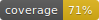

Langevin Project
----------------

*Eric Holmgren*

This project is a one dimensional Langevin Dynamics simulator written in Python. To run, execute `python lans.py` in the appropriate directory. System variables such as the tabulated potential, temperature, and timestep can be specified using a flag (e.g. --timestep=0.2). Default parameters are listed in lans.py. The potential, and the position and velocity as functions of time will be graphed. This data will be saved to an output table.

(c) 2017